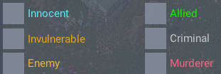

## Ultima-Online_scripts

Personal UO (TazUO's Legion and RazorEnhanced) scripts I'm using on [UOAlive](https://uoalive.com).

With some adjustments they might work on other shards too.

### Notes

- Pause time between spells varies depending on FC and FCR values of the caster.
- Bandage time depends on the DEX of the healer.

### TazUO remarks

- Data dirs
  - `Launcher/Profiles` - Server definitions
  - `TazUO/Data` - Account, client, assistant and map configurations
  - `TazUO/LegionScripts`

- How to get gump id

Record a macro that interacts with the gump and inspect the code, e.g.
wait for animal lore gump to appear and then close it:

```python
while not API.HasGump(0x1DDBAB48):
    API.Pause(0.1)
API.Pause(1)
    API.ReplyGump(0, 0x1DDBAB48)
```

- Mobile's notoriety name:color map



- Source files that are not run by the in-game script launcher directly (i.e. _utils.py_) cannot import [API](https://github.com/PlayTazUO/TazUO/blob/main/src/ClassicUO.Client/LegionScripting/docs/API.py).

### RE-specific

- Script cwd is C:\ClassicUO\ClassicUO (Wine + ClassicUO root dir in C:\ and RE as plugin).
- <RE_Root>/Config/AutoComplete.py contains mocks of the built-in classes and methods injected at runtime.

#### Demo

https://www.youtube.com/watch?v=s5KfpfYqFUo
